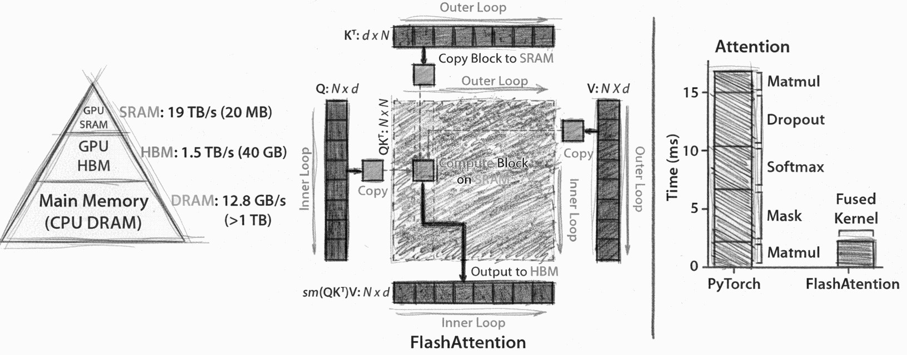

# FlashAttention for unsupported Tesla v100
This repository want to implement the official implementation of FlashAttention and [FlashAttention-2](https://github.com/ai-bond/flash-attention-v100/blob/main/docs/attention.md) under unsupported in TriDao repo [Nvidia Tesla V100](https://github.com/ai-bond/flash-attention-v100/blob/main/docs/volta.md)

**FlashAttention: Fast and Memory-Efficient Exact Attention with IO-Awareness** by Tri Dao, Daniel Y. Fu, Stefano Ermon, Atri Rudra, Christopher Ré

### TD; TR

- **What is suboptimal but necessary due to Volta:**
  - Softmax: Improving numerical stability above 2e-3 to 1e-3 cuz (f16).
  - Review compute speed on D>64 with PyTorch
  - Error correction: Volta unsupport bfloat or tf32 and WMMA instructions can't use float32 as marix_a(b) only half. Code need error correction implementation of conversion.
  - Implement: alibi, dropout
